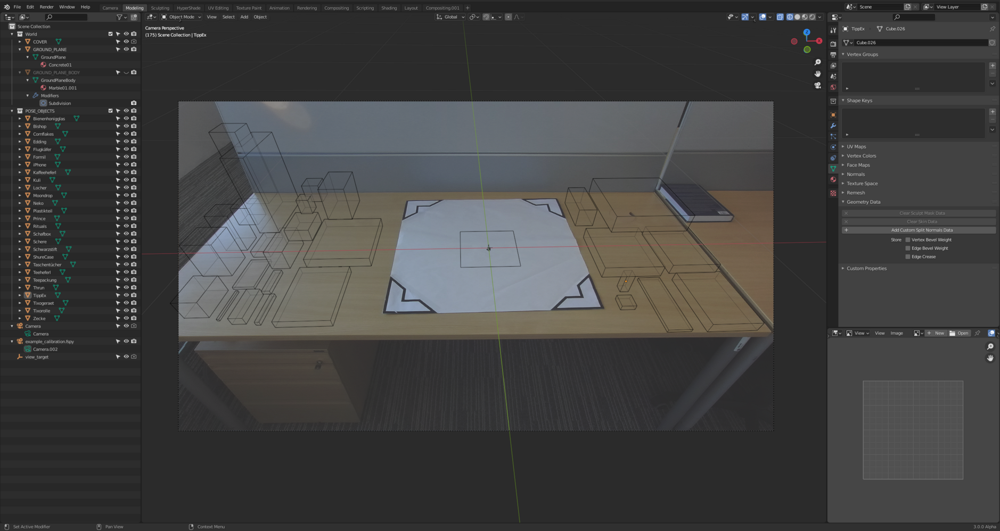
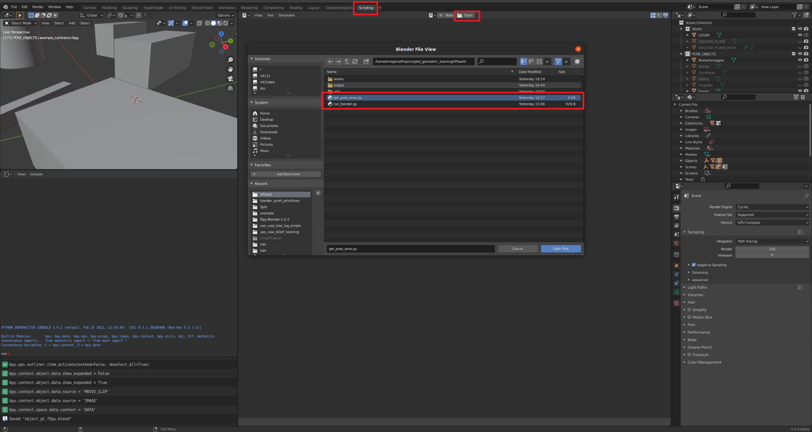

# PrimitivePose Annotation-Tool: A Tool to Annotate 6DoF Pose of Arbitrary Objects from RGB Images of Uncalibrated Cameras

### Introduction
We publish the annotation tool for PrimitivePose in this project.

PrimitivePose is an end-to-end Convolutional Neural Network built on CenterNet for 3D bounding box estimation of unseen objects.
In this repository we make the tool used to generate ground truth object pose annotations for our evaluations public. 
It uses fSpy to calibrate a monocular camera and obtain a virtual camera model. This is then imported in the Blender software and 
used together with 3D geometric primitive models of the objects to annotate their poses. Annotations are finally exported into .yml files 
and also visualized via overlays on the input images.
The manual annotation effort is resonable (3-5 minutes per image) - this pipeline is suited for annotation of real test data (100s to 1000s of images).

The annotation pipeline was presented in our paper: [IJSC](https://dx.doi.org/10.1142/S1793351X23620027), [RG](https://www.researchgate.net/publication/371451754_PrimitivePose_Generic_Model_and_Representation_for_3D_Bounding_Box_Prediction_of_Unseen_Objects#fullTextFileContent), [(PDF)](https://github.com/akriegler/akriegler.github.io/blob/master/assets/pdf/kriegler2023.pdf)

Authors: [Andreas Kriegler](https://www.researchgate.net/profile/Andreas-Kriegler), 
[Csaba Beleznai](https://www.ait.ac.at/ueber-das-ait/researcher-profiles/?tx_aitprofile_pi1%5Bname%5D=Beleznai+Csaba),
[Markus Murschitz](https://www.researchgate.net/profile/Markus-Murschitz),
[Kai Göbel](https://www.researchgate.net/profile/Kai-Goebel-2)
and [Margrit Gelautz](https://informatics.tuwien.ac.at/people/margrit-gelautz) 

It is possible to also use multiple cameras at once, to obtain multiple distinct views per object configuration. This also helps
validate the pose annotation step. 

Send questions to: andreas.kriegler@tuwien.ac.at

### Requirements
* A static RGB camera. This can anything from a cellphone camera to industrial sensors, fixed via camera mount or tripod.
* A calibration pattern. It should be rectangular, with one known side length and be in scale with the scene.
* The fSpy software. Used to create a virtual camera file with intrinsic and extrinsic calibration.
* The Blender software (we used 3.0) with fSpy addon. Used for the annotation process itself.

All software is freely available. The tool was tested on Ubuntu 20.04, using Blender 3.0.1, fSpy 1.0.3 and Python 3.9.
Additionally it was tested on Windows 10, using Blender 3.0.1, fSpy 1.0.3 and Python 3.9.7

### Sofware-Setup
* [Download and install the Blender software](https://www.blender.org/download/) 
* [Download and install the fSpy toolkit](https://fspy.io)
* [Download and install the fSpy addon for Blender](https://github.com/stuffmatic/fSpy-Blender)

Blender comes with its own python distribution (see the Blender/python/bin folders). A few extra packages need to be installed for this interpreter. This can generally
be done by done installing pip in that python and then using pip to install the packages. An alternative method, and the one we recommend, is to use an IDE to access and configure Blender. 
This provides the additional benefits of a proper editor if you want to change the scripts, as well as cleaner console output.
Set the python interpreter in the IDE to Blender python. Then: 

* Run [pip_install.py](utils/pip_install.py) to install the dependencies for Blender python
* Configure the blender path in [run_blender.py](run_blender.py) and set your own .blend file
* (Optional) ZEDCam setup: The only requirements are a static monocular camera. We used the ZEDCam2 although stereo images are NOT required ([doc](https://www.stereolabs.com/docs/installation/)). 

### 1) Extrinsic camera calibration + capturing image data
A calibration pattern is required that features two sets of two parallel lines, the sets orthogonal to one another, for example a rectangle. 
One side length has to be known. The size of the pattern should be in adequate scale with the scene and the camera distance. For example if you know your objects can be in 
an area of size 4m x 4m a calibration pattern of only 0.2m x 0.2m will (most likely) lead to poor results. 

Fix your camera in the desired pose to record the subsequent dataset. Place the calibration pattern well visible in the scene on the ground plane (or another flat surface), 
the exact location or rotation is not important. Capture an image, the calibration frame for this camera pose. 

You can now remove the pattern and take pictures of the scene featuring the objects of interest.

If you want to take pictures with a different camera pose remember to capture another calibration frame.

### 2) Virtual camera model

Start the fSpy application and drop a calibration frame onto the GUI. Then drag the endpoints of the green and red line 
segments to align the axes with your calibration rectangle. This also defines the orientation of the world coordinate frame.

Provide scale to the image by measuring the side of known length. To do so, click on "Reference distance" in the 
left view, select an axis and provide the metric measurement. A line segment will appear fixed in one dimension.
Drag the endpoints for alignment. 

Finally, save the calibration as a .fspy file  via "File -> Save as"-

Tip: Selecting rectangle mode helps with alignment. Holding the SHIFT key provides local magnification. 
Setting the 3D guide to "xy grid floor" visualizes the estimated ground plane. The origin of the estimated coordinate 
frame can be dragged around. For later steps, the Z axis should be pointing upwards from the object plane. Generally, 
setting the principal point to the image midpoint gives best results. 

Example on Windows:

### 3) Blender object pose annotation

Open Blender, e.g. by running [start_blender.py](run_blender.py). Load the .fspy file created previously via "File -> Import -> fSpy". 

Then, model your objects of interest in metric scale (using the modelling tab). If you are only interested in the pose parameters, you can model every object with a 3D cuboid, dimensions equaling the 3D BBox around the real object.

Constrain the translations and rotations of the object if applicable. If all objects will lie on the ground plane, it helps to set the Z location 
to half the Z dimension and locking this setting with the padlock symbol. Similar steps can be done for the rotations, e.g. locking rotations around X and Y to 0 deg.
These constraints help to speed up the later annotation steps.
Tip: We provide an example .blend file at [example.blend](demo/blender/example.blend). 
Within Blender, you can always change into camera-view via Numpad(0).  If your objects can be approximated with 3D geometric primitives, 
they can be easily recreated in Blender by adding the corresponding mesh objects, instead of only using cuboids.

Start loading the captured frames for pose annotation. To do so, make sure the fspy camera object is selected,
then expand "Background Image" in the right-hand window pane and load the image via "Add Image". You can enable or disable
visualization of the image by clicking the screen icon here too. Then start aligning Blender objects and real objects.

You can drag the centerpoint for translation changes, and if you have locked the Z location this is a planar operation. 
Use the "R" key to change the object rotation. For objects that have geometric rotational symmetry around Z you can leave 
rotations at 0 deg or use appearance cues to guide the rotation. 

It is likely that the Blender bounding boxes differ in size from the real objects by some small percentage but this is
irrelevant for extracting the pose of the objects. If you notice strong disagreements that also affect angles you might
want to consider repeating the calibration with fSpy. 

### 4) Annotation export 

When all objects have been aligned for the current frame, pose annotations can be calculated and exported. To do so,
create a new collection (right-click Scene Collection -> New Collection) called "POSE_OBJECTS". For all objects that are 
in this collection _and_ that have their hide_render flag disabled (default) pose annotations will be created. To disable objects
click the small camera icon next to them (you can also disable them from view by clicking the eye icon).

Finally, switch to the Scripting tab and load [get_pose_anno.py](get_pose_anno.py). You can change the default annotation export paths.

Run the script by clicking on the play symbol or using "ALT + P" to obtain a .yml file + visualization for the current view.

Important parameters of the script (see function <set_params> in [get_pose_anno.py](get_pose_anno.py))
* Set 'out_path' to the desired output folder, otherwise the location of the images is used.
* Enable 'get_occlusion' if you want to use Blender ray-casting methods to get occlusion metrics. 

### Explanations for the content of exported annotation .ymls:
* img_file: relative path to the img file from the point of the .blend file location
* cam_mat: 3x3 camera matrix as estimated by fSpy

Then, for every object the following parameters are exported (length units are meters):
* X_dims: dimensions of the object in X, Y, Z axis order
* X_bb2d: bounding box coordinates in pixels, in the order of: ul_x, ul_y, lr_x, lr_y, i.e. x/y coordinates of the upper-left corner
followed by x/y coordinates of the lower right corner.
* X_tdbb: the squashed 8x3 matrix giving the location of all 8 cornerpoints of the 3D bounding box in the camera coordinate system.
See <compute_box_3d> and <project_to_image> in [pose_tools](utils/pose_tools.py)
* X_center: Location of the center of the object. The first two values give the X and Y image coordinates of the 2D projection of the 3D object center point. The third value gives the depth value,
specifically the length of the vector along the Z-axis connecting the two centers in 3D space.
* X_translation: Translation vector from camera center to object center. 
* X_rotation_app: the apparent rotations of the object in reference to the camera. The order of the rotations is X, Z, Y
and they are given in rad units. It helps to imagine the three rotations as follows: first value gives the elevation angle
of the object-camera system. It decreases with objects that are further away (they are more in line with the XY-plane of the camera)
and increases for objects close (underneath) the camera. The second angle describes the in-plane rotation of the object,
around the gravity vector. The third angle describes the out of plane rotation angle of the object. For planar objects this is zero.
* X_rotation_abs: absolute rotations of the object in reference to the camera. This is equal to the apparent rotation
iff the object is exactly in line with the camera view center, i.e. the object center point lies on the vertical line
splitting the image in left and right halves. 
* X_view_pix_perc gives the ratio of visible pixels and the total image area. This is useful for filtering small/large objects.
* X_occ_pix_perc gives the percentage of 2D object pixels that are occluded by another object. This ranges from
0 to 100 for fully visible or fully occluded objects respectively. This is useful for filtering occluded objects.

Tip: Set the parameter 'force_symmetry_angle_zero' to True when modeling object with cylindrical (or spherical) meshes to resolve ambiguities.
Additionally, for planar objects you can force the out of plane rotation angle to be 0 with 'force_planar_angle_zero', alleviating imprecision of the
fSpy calibration. 
